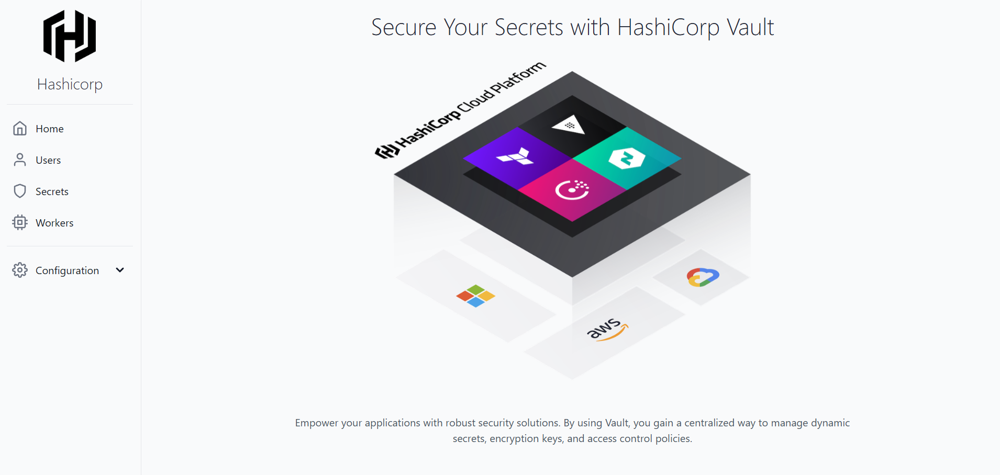
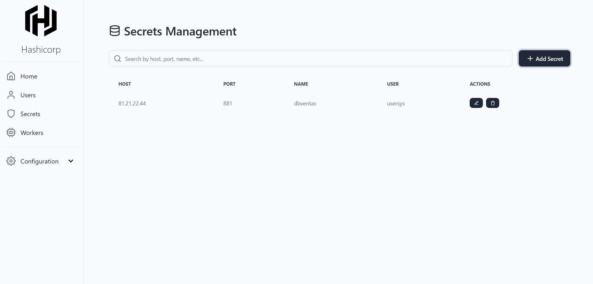

# Documentación de proyecto Hashicorp

## Proyecto creado con React, Flask y Vault

Este proyecto almacena y recupera configuraciones cifradas utilizando HashiCorp Vault. Está dividido en dos partes:

- Backend: Gestiona la interacción con Vault utilizando Flask.
- Frontend: Interfaz de usuario construida con React y TailwindCSS.

El objetivo es permitir a los usuarios guardar múltiples configuraciones y recuperarlas de forma segura.

## Requisitos Previos

- Python 3.8+ y pip
- Node.js 18+ y npm o yarn
- HashiCorp Vault
- Git

## Configuración del frontend

cd frontend
npm install
npm run dev

### .env
VITE_API_URL=http://localhost:5000

## Configuración del backend (se recomienda usar PyCharm)

pip install -r requirements.txt (en dado caso de faltar dependencias instalar manualmente)
python app.py

### config.py
VAULT_URL = 'http://127.0.0.1:8200'  # Dirección del servidor Vault
VAULT_TOKEN = '<root_token>'         # Token raíz de Vault

## Configuración del Vault

vault server -dev

### Sugerencia de video

Se sugiere ver el siguiente video para facilitar la instalacion y configuracion exacta del Vault:

LINK: https://www.youtube.com/watch?v=Z06BFJY4rWM

# Imagenes ilustrativas

