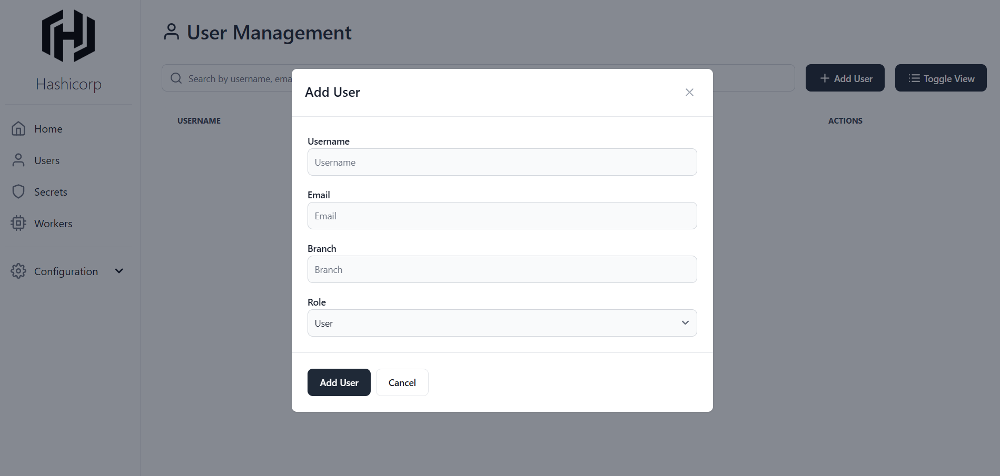

# **Documentación del Proyecto Hashicorp**

## **Descripción del Proyecto**
Este proyecto almacena y recupera configuraciones cifradas utilizando **HashiCorp Vault**. Está dividido en dos partes principales:

- **Backend:** Gestiona la interacción con Vault utilizando Flask.
- **Frontend:** Interfaz de usuario construida con React y TailwindCSS.

El objetivo es permitir a los usuarios guardar múltiples configuraciones y recuperarlas de forma segura.

---

## **Requisitos Previos**

Antes de comenzar, asegúrate de tener instalados los siguientes programas:

- Python 3.8+ y `pip`
- Node.js 18+ y `npm` o `yarn`
- HashiCorp Vault
- Git

---

## **Configuración del Frontend**

### 1. Navegar a la carpeta del frontend
```bash
cd frontend
```

### 2. Instalar dependencias
```bash
npm install
```

### 3. Configurar variables de entorno
Crea un archivo `.env` en la carpeta `frontend/` con el siguiente contenido:
```env
VITE_API_URL=http://localhost:5000
```

### 4. Iniciar el servidor de desarrollo
```bash
npm run dev
```

---

## **Configuración del Backend**

### 1. Crear y activar un entorno virtual (opcional)

```bash
# En Linux/Mac
python3 -m venv venv
source venv/bin/activate

# En Windows
python -m venv venv
venv\Scripts\activate
```

### 2. Instalar dependencias
```bash
pip install -r requirements.txt
```
Si faltan dependencias, instálalas manualmente utilizando:
```bash
pip install <nombre_paquete>
```

### 3. Configurar variables de entorno
Crea un archivo `config.py` en la carpeta `backend/` con el siguiente contenido:
```python
VAULT_URL = 'http://127.0.0.1:8200'  # Dirección del servidor Vault
VAULT_TOKEN = '<root_token>'         # Token raíz de Vault
```

### 4. Iniciar el servidor Flask
```bash
python app.py
```

---

## **Configuración de Vault**

### 1. Iniciar Vault en modo desarrollo
Ejecuta el siguiente comando en una terminal:
```bash
vault server -dev
```

Esto iniciará Vault en modo desarrollo. Asegúrate de copiar el **root_token** que aparece en la terminal e insértalo en el archivo `config.py`.

### 2. Recursos adicionales
Se recomienda ver el siguiente video para facilitar la instalación y configuración exacta de Vault:

[**Video Tutorial**](https://www.youtube.com/watch?v=Z06BFJY4rWM)

---

## **Ejecución del Proyecto Completo**

### 1. Iniciar el servidor Vault
En una terminal, ejecuta:
```bash
vault server -dev
```

### 2. Iniciar el backend
En otra terminal, navega a la carpeta `backend` y ejecuta:
```bash
python app.py
```

### 3. Iniciar el frontend
En una nueva terminal, navega a la carpeta `frontend` y ejecuta:
```bash
npm run dev
```

### 4. Acceder al proyecto
Abre el navegador y visita:
```
http://localhost:5173
```

---

## **Imágenes Ilustrativas**

### Ejemplo del Frontend:


### Ejemplo de Configuración en Vault:


### Ejemplo de Ejecución del Proyecto:


---

